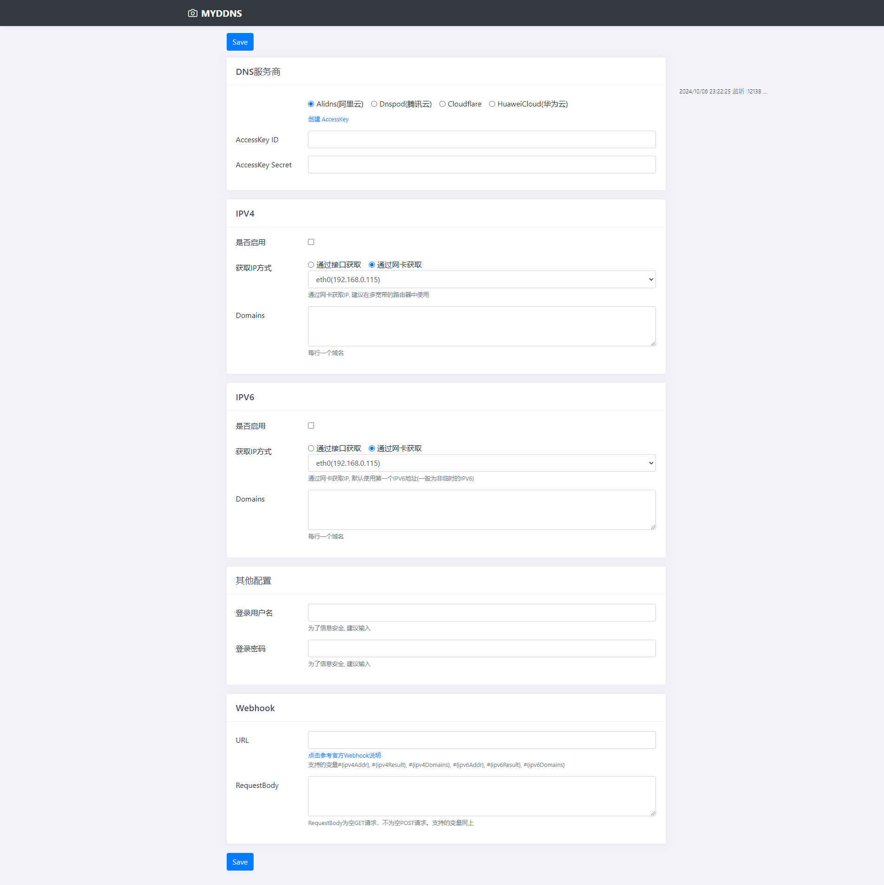

# myddns
- DDNS 动态域名系统，Dynamic DNS
- 服务端在网络不稳定状态下，ip发生变化
- 本服务目的用于周期发布用户服务的 公网IP 给到DNS服务器
- 支持多级域名
- 支持跨平台跨架构运行，x86,arm,  *nix, win, mac
- /logs 子域名 页面快速查看最近50条日志 简化日志审查
- 网页中简单配置,可设置用户名账号密码 禁止从公网访问
- 支持接口/网卡获取IP
- 默认设定间隔5分钟同步一次
- 安装在系统中,支持 service 或者 systemctl 管理(v2.8.0)之后支持
- 复刻自 ddns-go


## 可选域名供应商

+ Alidns 阿里云
+ Dnspod 腾讯云
+ cloudflare
+ 华为云
+ webhook


## 普通环境使用

- 下载[https://github.com/alongnice/myddns/releases](https://github.com/alongnice/myddns/releases)
- 运行，程序将自行打开浏览器，访问 [http://127.0.0.1:12138](http://127.0.0.1:12138)完成配置修改
- [可选] 支持启动带参数 `-l`监听地址 `-f`间隔时间（秒）。如：`./myddns -l 127.0.0.1:9876 -f 300` 
- [可选] 服务管控
  - Mac/Linux: `sudo ./myddns -s uninstall` 
  - Win(以管理员打开cmd): `.\myddns.exe -s uninstall`


## Docker使用

- 挂载主机目录, 删除容器后配置不会丢失。可替换 `/opt/myddns` 为主机上的任意目录, 配置文件为隐藏文件

  ```bash
  docker run -d --name myddns --restart=always -p 9876:9876 -v /opt/myddns:/root alongnice/myddns
  ```

- 不挂载主机目录, 删除容器同时会删除配置

  ```bash
  docker run -d --name myddns --restart=always -p 9876:9876 alongnice/myddns
  ```

## 自行构建

> 开发环境 golang 1.16
+ `make build` 构建本地编译版本的 `myddns` 可执行文件。
+ `make build_docker_image` 本地自动化编译、打包 Docker 镜像。


## 使用 IPV6

    - 前提: 你的环境需要支持 IPV6
    - Windows/Mac 系统推荐在 `系统中使用`, windows/mac 桌面的docker不支持主机网络 `--net=host`
    - Linux的x86或arm架构，如服务器、群晖(网络中勾选`使用与docker相同的网络`)、xx盒子等等，推荐使用`--net=host`模式
    - 
    - 群晖：
      - 套件中心下载docker并打开
      - 注册表中搜索`myddns`并下载
      - 映像 -> 选择`alongnice/myddns` -> 启动 -> 高级设置 -> 网络中勾选`使用与 Docker Host 相同的网络`，高级设置中勾选`启动自动重新启动`
      - 在浏览器中打开`http://群晖IP:9876`，修改你的配置，成功

```bash
docker run -d \
    --name myddns \
    --restart=always \
    -v /opt/myddns:/root \
    --net=host \
    alongnice/myddns
```
- 虚拟机存在可能能获取IPV6,但是无法正常访问
- [可选] 使用IPV6后，建议设置登录用户名和密码

## Webhook

- 支持webhook, 当IP更新成功或者失败, 会回调填写的URL
- 支撑变量
  
| 变量名 | 说明 |
| ----- | ---- |
| #{ipv4Addr}| 新的ipv4地址 |
| #{ipv4Result}| IPv4地址的更新结果:`未改变` `失败` `成功` |
| #{ipv4Domains}|Ipv4的域名,多个域名用逗号分隔 |
| #{ipv6Addr}| 新的ipv6地址 |
| #{ipv6Result}| IPv6地址的更新结果:`未改变` `失败` `成功` |
| #{ipv6Domains}|Ipv6的域名,多个域名用逗号分隔 |

- RequestBody 为空 GET 请求, 不为空 POST 请求
- 示例
- 例(URL):  `https://sc.ftqq.com/[SCKEY].send?text=主人IPv4变了#{ipv4Addr},更新结果:#{ipv4Result}`
- 例(RequestBody): `{"text":"你的IPv4已变为#{ipv4Addr}","desp":"更新结果: #{ipv4Result}"}`


- 钉钉:
  - 钉钉电脑端 -> 群设置 -> 智能群助手 -> 添加机器人 -> 自定义
  - 只勾选 `自定义关键词`, 输入的关键字必须包含在RequestBody的content中, 如：`你的公网IP变了`
  - URL中输入钉钉给你的 `Webhook地址` 
  - RequestBody中输入 `{"msgtype": "text","text": {"content": "你的公网IP变了：#{ipv4Addr}，域名更新结果：#{ipv4Result}"}}`
---

- 在docker主机上打开[http://127.0.0.1:12138](http://127.0.0.1:12138)，修改你的配置，成功
